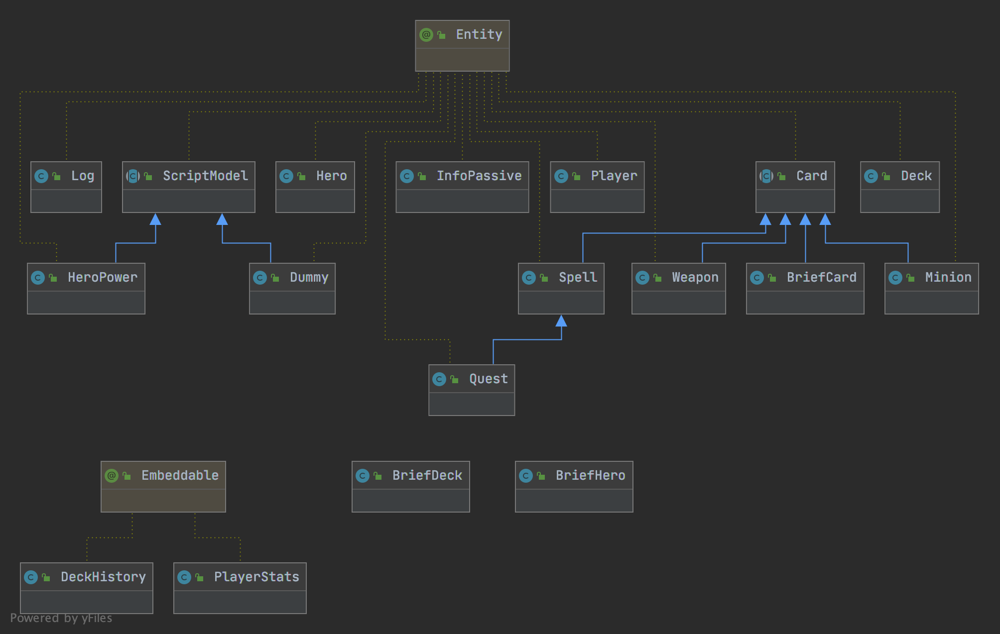
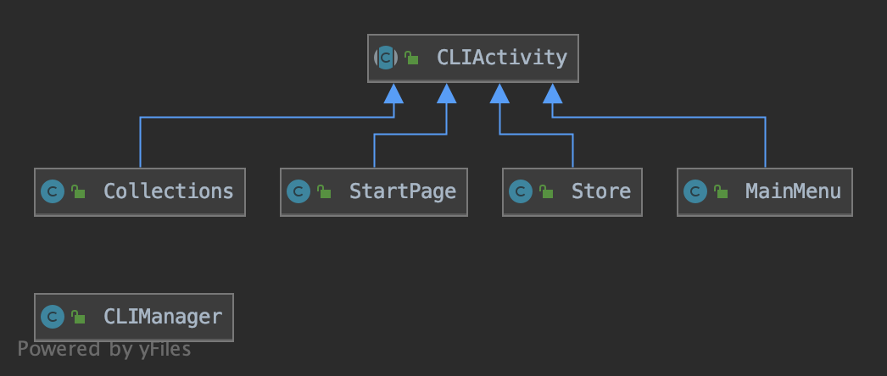
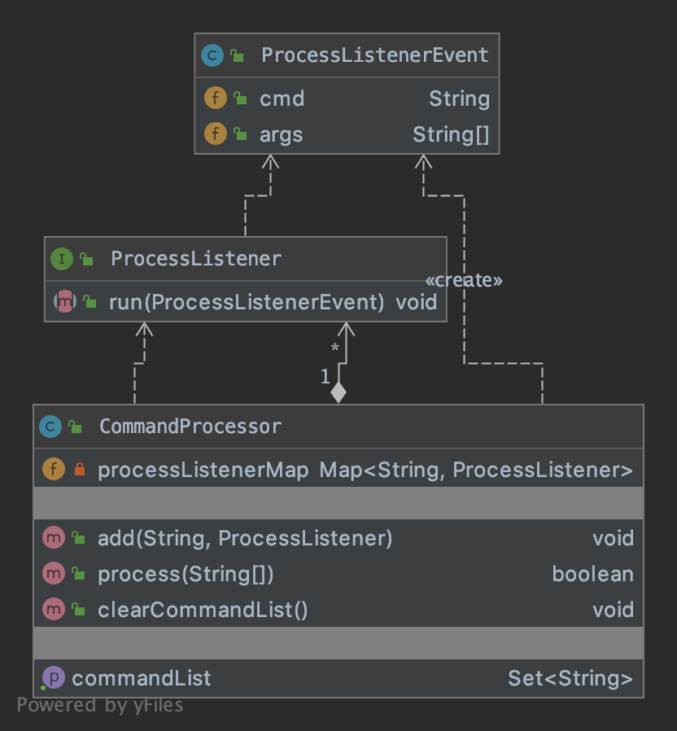
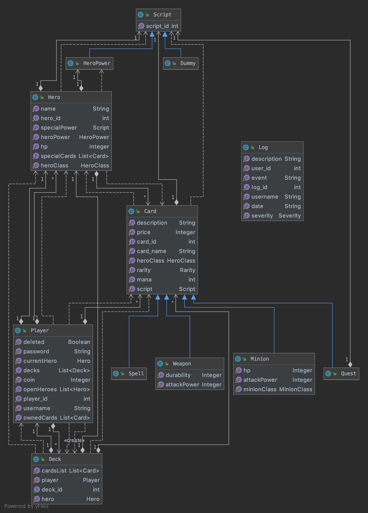
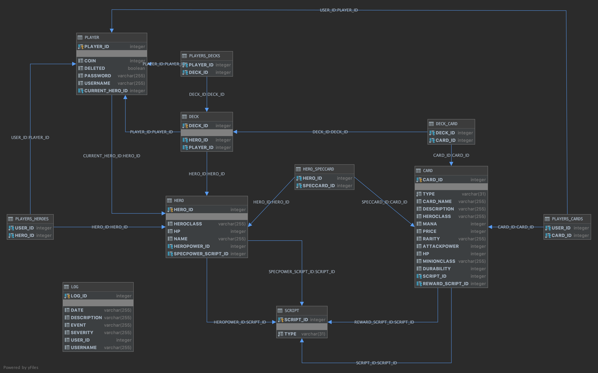

# Emulation of Hearthstone game
_Under development._ 

## How to Run
Before running, setup a postgres database and insert database info in Constants.java.
Then in the source package(ir.soroushtabesh.hearthstone) create an instance of server
 by running MainServer class. After that you may run as many instances of MainClient as
 you want. 

## Phase 4 Documentation
This phase implements network multiplayer game mode.

### Libraries and Dependencies
Java 13 is used for build.
Project is built using Gradle
and obviously is maintained under git. 

- [Hibernate](http://hibernate.org/orm/) - Robust and widely used ORM, with an active community.
- [PostgreSQL](https://www.postgresql.org/) - An advanced open-source relational database.
- [Apache Log4j 2](https://logging.apache.org/log4j/) - Taking control of Hibernate logging.
- [Guava](https://github.com/google/guava) - Collections, caching, primitives support, concurrency libraries, common
 annotations, string processing, I/O, and more.
- [Apache Commons Codec](http://commons.apache.org/proper/commons-codec/) - General encoding/decoding algorithms, e.g. 
phonetic, base64 or URL. 
- [OpenJFX](https://openjfx.io/) - Alternate JavaFX library as it's no longer contained in JDK.
- [Apache Lang](http://commons.apache.org/proper/commons-lang/) - Provides extra functionality for classes in java.lang.
e.g. CompareToBuilder.
- [AnimateFX](https://github.com/Typhon0/AnimateFX) - A library of ready-to-use animations for JavaFX.

### Resources

- [Game Pedia](https://hearthstone.gamepedia.com/) - A complete resource of game cards and heroes.
- [Hearthstone's assets](https://github.com/GitHtub/Hearthstone/tree/master/Assets) - UI elements and font.
- [Vlad Mihalcea' Blog](https://vladmihalcea.com/) - Contains perfect articles on Hibernate.
- [Baeldung](https://www.baeldung.com/) - Tutorials of hibernate.
- [SVG PathBuilder](https://codepen.io/anthonydugois/full/mewdyZ) - Online tool for making SVG paths.
- [SoundBible](http://soundbible.com/) - A free online library of soundfx

### A brief description of architecture
In network package, ComServer class listens for client socket connections an instantiates a worker
for each client. Client-Server communication follows a custom request-response system; It sends packets which
may contain commands, parcels, and messages. Each packet has its own unique id which comes handy when there 
are linked packets. A socket worker uses TCP for communication.   
There are a set of classes implementing Command interface; They are mapper classes which
map commands to real jobs in the target jvm. Packet commands are actually class names of Command classes.

## Phase 3 Documentation
This phase implements a logic unit to manage gameplay.

### Libraries and Dependencies
Java 13 is used for build.
Project is built using Gradle
and obviously is maintained under git.

- [Hibernate](http://hibernate.org/orm/) - Robust and widely used ORM, with an active community.
- [H2](https://h2database.com) - Small SQL database, with embedded mode available.
- [Apache Log4j 2](https://logging.apache.org/log4j/) - Taking control of Hibernate logging.
- [Guava](https://github.com/google/guava) - Collections, caching, primitives support, concurrency libraries, common
 annotations, string processing, I/O, and more.
- [Apache Commons Codec](http://commons.apache.org/proper/commons-codec/) - General encoding/decoding algorithms, e.g. 
phonetic, base64 or URL. 
- [OpenJFX](https://openjfx.io/) - Alternate JavaFX library as it's no longer contained in JDK.
- [Apache Lang](http://commons.apache.org/proper/commons-lang/) - Provides extra functionality for classes in java.lang.
e.g. CompareToBuilder.
- [AnimateFX](https://github.com/Typhon0/AnimateFX) - A library of ready-to-use animations for JavaFX.

### Resources

- [Game Pedia](https://hearthstone.gamepedia.com/) - A complete resource of game cards and heroes.
- [Hearthstone's assets](https://github.com/GitHtub/Hearthstone/tree/master/Assets) - UI elements and font.
- [Vlad Mihalcea' Blog](https://vladmihalcea.com/) - Contains perfect articles on Hibernate.
- [Baeldung](https://www.baeldung.com/) - Tutorials of hibernate.
- [SVG PathBuilder](https://codepen.io/anthonydugois/full/mewdyZ) - Online tool for making SVG paths.
- [SoundBible](http://soundbible.com/) - A free online library of soundfx

### A brief description of architecture

#### Logic
If you have ever played Hearthstone, you may have noticed that it's a game which mainly 
relies upon events rather than realtime gameplay. This suggests you to design an event-driven 
system to manage the logic and functionality of cards. However, a simple polymorphic system
won't do the job as if used, 
you'd need to write a script for every card you have and more importantly, you 
would have not been able to combine functionality of cards and scripts to make new ones which 
causes you to write even more scripts!    
That brings us to a dynamic hierarchical script system which supports combination of scripts.
The system I designed for this project, mainly follows Decorator and Composite design patterns;
meaning the scripts can even be combined in runtime, and their structure is not static.   
Also, the script system uses Java Reflection to load scripts which enables us to load scripts
dynamically.   
The scripts are also reusable in other forms. The script system ables one to load a json
file along with the script class which lets you to use a single scripts but with 
different parameters for various cards.

#### Player Controller
Not everyone can have edit-access on the models! The act of playing can only be done using 
a Player Controller interface which even limits a player to act only behalf of himself!

#### Game Objects
The state-system of the game controller holds observable data models. Therefore, any change on any model
gets simply reflected to whichever object needed which eases the communication with
View system.    
Game objects all have a unique identifier registered in a model pool therefore any entity has a single
strong-referenced model which can be read across the application. this unique identifier is also used
for hashing of the models.

#### GUI
##### Animation pool
All animations get registered in an Animation Pool in order to become easier to
manage.
##### Drag and Drop
The actions of playing cards are mainly done using drag and drop.
##### View-Model
view is linked to the game models using observers. 

#### Extensibility 
The Logic depends on a high-level GameController class. Therefore, in order to add an Online Mode
to the game the only change needed is to add a Proxy or Inherited class to direct game request to
a server.

#### Deck Reader
Uses json to load card names and build the corresponding deck object.

## Phase 2 Documentation
This phase implements a graphical UI to interact with data models and there's a minimal implementaion of 
board and logic.
### Libraries and Dependencies
Java 13 is used for build.
Project is built using Gradle.

- [Hibernate](http://hibernate.org/orm/) - Robust and widely used ORM, with an active community.
- [H2](https://h2database.com) - Small SQL database, with embedded mode available.
- [Apache Log4j 2](https://logging.apache.org/log4j/) - Taking control of Hibernate logging.
- [Guava](https://github.com/google/guava) - Collections, caching, primitives support, concurrency libraries, common
 annotations, string processing, I/O, and more.
- [Apache Commons Codec](http://commons.apache.org/proper/commons-codec/) - General encoding/decoding algorithms, e.g. 
phonetic, base64 or URL. 
- [OpenJFX](https://openjfx.io/) - Alternate JavaFX library as it's no longer contained in JDK.
- [Apache Lang](http://commons.apache.org/proper/commons-lang/) - Provides extra functionality for classes in java.lang.
e.g. CompareToBuilder.
- [AnimateFX](https://github.com/Typhon0/AnimateFX) - A library of ready-to-use animations for JavaFX.

### Resources

- [Game Pedia](https://hearthstone.gamepedia.com/) - A complete resource of game cards and heroes.
- [Hearthstone's assets](https://github.com/GitHtub/Hearthstone/tree/master/Assets) - UI elements and font.
- [Vlad Mihalcea' Blog](https://vladmihalcea.com/) - Contains perfect articles on Hibernate.
- [Baeldung](https://www.baeldung.com/) - Tutorials of hibernate.
- [SVG PathBuilder](https://codepen.io/anthonydugois/full/mewdyZ) - Online tool for making SVG paths.

### A brief description of architecture

####GUI
- Oracle has stopped maintaining JFX since Java11. So in order to keep my program runnable on various environments
I switched to OpenJFX. In addition, OpenJFX's newer versions have fixed older JFX bugs and improved it in various ways.
- The GUI follows an MVC pattern as JFX suggests. GUI's controllers are simply mapper classes reaching logic's controllers.  
- Flyweight design pattern is used for loading the cards because cards are used in multiple places and are expensive to build.
- A Scene Management system is used for scene transmition and loading.  
####Models
- Database communication is done using a Dependency Injection which DBUtil class provides.   
- Data models are mostly JPA entities but for the sake of ease, some Proxy classes(starting with prefix Brief-) are implemented
to avoid direct modification of JPA entities.   
- The view-model binding is controlled via Observers as this game is event-based.   
- Data models which contain Collections, are always being lazily loaded to reduce memory-cpu load. Lazy loading is done using 
Hibernate's internal Proxy classes.   
- Hibernate is configuered to use second-level cache.  
- Database transactions are controlled under a local Transaction management to avoid concurrent modification of database and 
cached models.

 | Database relations |
 | ------------- |
 |  |
 

####Controllers
- Logic's controllers are Singleton classed shared in Program as they're uniquely defined per user.    

### Logging
Before establishing a stable connection with the database, Log4j is solely used for logging events in a file but after connecting to the database,
logs are recorded in a database table and SQL logs are recorded in a file.

 

## Phase 1 Documentation
This phase implements data models, and a modest CLI for the sake of test. CLI supports user sign-up, login session,
 a simple collection management system and a simple store system.
### Libraries and Dependencies
Java 13 is used for build.
Project is built using Gradle.

- [Hibernate](http://hibernate.org/orm/) - Robust and widely used ORM, with an active community.
- [H2](https://h2database.com) - Small SQL database, with embedded mode available.
- [Apache Log4j 2](https://logging.apache.org/log4j/) - Taking control of Hibernate logging.
- [Guava](https://github.com/google/guava) - Collections, caching, primitives support, concurrency libraries, common
 annotations, string processing, I/O, and more.
- [Java ASCII Render](https://github.com/indvd00m/java-ascii-render) - Graphical primitives for the console.
- [Apache Commons Codec](http://commons.apache.org/proper/commons-codec/) - General encoding/decoding algorithms, e.g. 
phonetic, base64 or URL.

### CLI
CLIManager is a Singleton class for managing CLIActivities. Each page in CLI is a subclass of CLIActivity abstract.

An Activity follows several design patterns;
CLIActivity is an Observer to CLIEvents handled by CLIManager. CLIActivity also follows Command pattern; The CLIManager 
calls commands in an Activity, based on the lifecycle of Activities. It is also an Adapter to manage unhandled events 
by its subclasses. The latter events are commands or observations by CLIManager.

Commands of an Activity are:
- onStart
- onResume
- onPause
- onStop
- onCommandReceived

Observations are handled by CommandProcessor system and then passed to onCommandReceived. Hence 
onCommandReceived becomes an indirect observer of commands.

| CLI Class Diagram |
| ------------- |
|  |

#### CLI Help
At any time in the app (except in case of special input like username or password) you may call `hearthstone --help` to get a guide to the current state of CLI.
An additional universal help will be also shown.

### Command Processor
The CommandProcessor system accepts Observers of commands. You may register ProcessListener associated with a command, to the processor
and then let processor handle the incoming CLI inputs which will be then relayed to the assigned Listener. 

After adding necessary commands, it would suffice to call process method with tokenized input line to get the processor running.

**CLIManager uses special tokenizer which would avoid white space splitting inside quotations.** 
For example `this is -a "test for processor"` will be tokenized to `[this, is, -a, test for processor]`.
As you see quotations marks are ignored after tokenize.

| Command Processor Class Diagram |
| ------------- |
|  |

### Player Management
PlayerManager is a Singleton controller for Player model. PlayerManager takes responsibility for creating and deleting accounts,
managing login session for players and passing Player singleton when logged in.

### DB Utilities
An Extract of widely used methods to communicate with hibernate. Also manages singletons for db sessions and registries.

### Database Seeding
A Seeder class is also included to prepare the default state of database.

### Logging
A Logger class is also included in the project to record everything in database.
A log consists of event and it's description alongside player session , timestamp and severity level.

### Data Models; The BIG BOSS!
The models are:
- Player
- Hero
- Deck
- Card
    - Minion
    - Quest
    - Spell
    - Weapon
- Script
    - Dummy
    - HeroPower
- Log

In addition, modeling of the data, needed adding of extra tables to preserve the relations:

| Models UML |
| ------------- |
|  |

| Database relations |
| ------------- |
|  |

